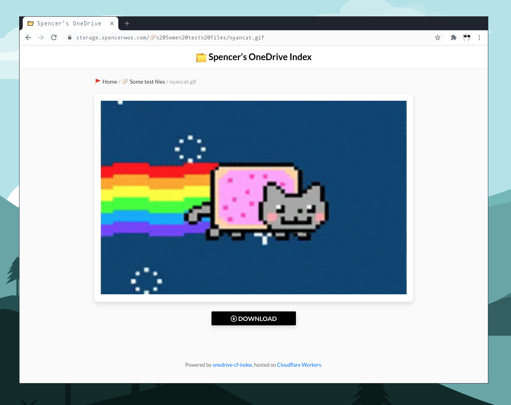
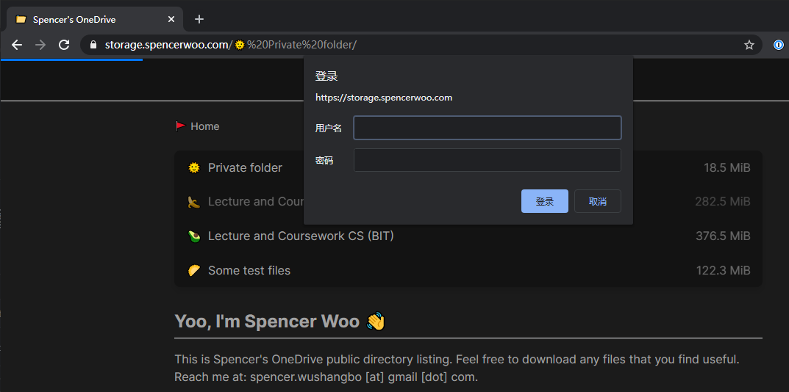
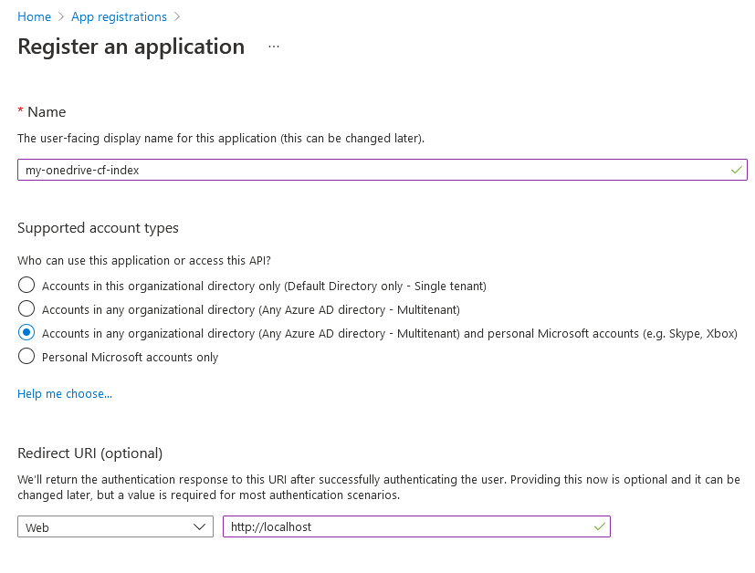
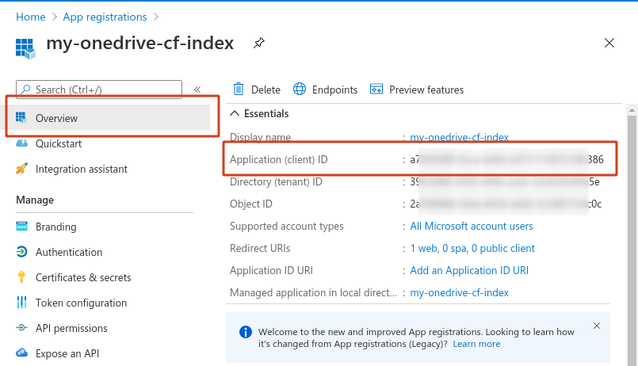
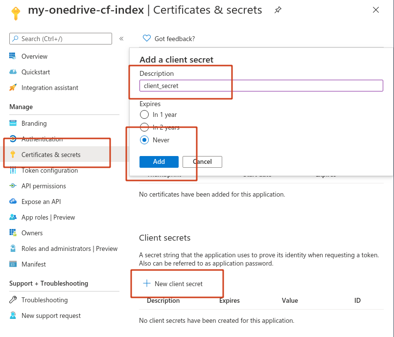
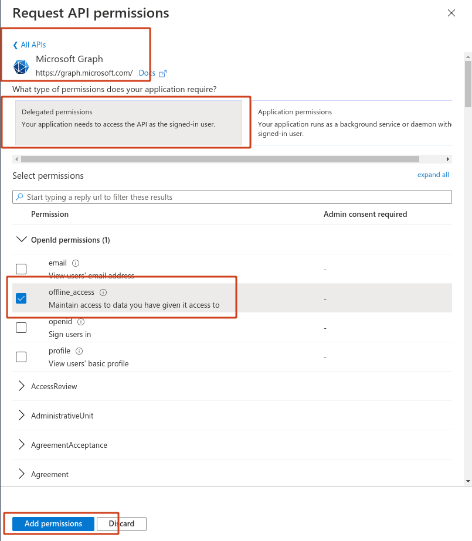
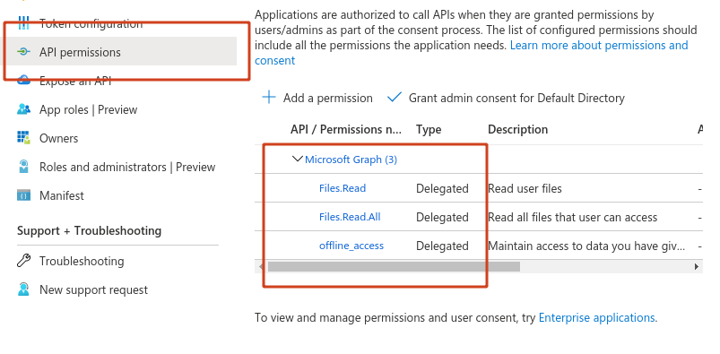

<div align="center">
  <image src="assets/onedrive-cf-index.png" alt="onedrive-cf-index" width="150px" />
  <h3><a href="https://storage.spencerwoo.com">onedrive-cf-index</a></h3>
  <em>由 CloudFlare Workers 强力驱动的 OneDrive 索引</em>
</div>

---

[](https://storage.spencerwoo.com/)
[](https://github.com/spencerwooo/onedrive-cf-index/actions?query=workflow%3ADeploy)
[](./README-CN.md)

<h5>本项目使用 CloudFlare Workers 帮助你免费部署与分享你的 OneDrive 文件。本项目极大源自：<a href="https://github.com/heymind/OneDrive-Index-Cloudflare-Worker">onedrive-index-cloudflare-worker</a>，致敬。</h5>

## Demo

在线演示：[Spencer's OneDrive Index](https://storage.spencerwoo.com/).



## 功能

### 🚀 功能一览

- 全新「面包屑」导航栏；
- 令牌凭证由 Cloudflare Workers 自动刷新，并保存于（免费的）全局 KV 存储中；
- 使用 [Turbolinks®](https://github.com/turbolinks/turbolinks) 实现路由懒加载；
- 支持由世纪互联运营的 OneDrive 版本；
- 支持 SharePoint 部署；

### 🗃️ 目录索引显示

- 全新支持自定义的设计风格：[spencer.css](themes/spencer.css)；
- 支持使用 Emoji 作为文件夹图标（如果文件夹名称第一位是 Emoji 则自动开启该功能）；
- 渲染 `README.md` 如果当前目录下包含此文件，使用 [github-markdown-css](https://github.com/sindresorhus/github-markdown-css) 渲染样式；
- 支持「分页」，没有一个目录仅限显示 200 个项目的限制了！

### 📁 文件在线预览

- 根据文件类型渲染文件图标，图标使用 [Font Awesome icons](https://fontawesome.com/)；
- 支持预览：
  - 纯文本：`.txt`. [_DEMO_](https://storage.spencerwoo.com/%F0%9F%A5%9F%20Some%20test%20files/Previews/iso_8859-1.txt).
  - Markdown 格式文本：`.md`, `.mdown`, `.markdown`. [_DEMO_](https://storage.spencerwoo.com/%F0%9F%A5%9F%20Some%20test%20files/Previews/i_m_a_md.md).
  - 图片（支持 Medium 风格的图片缩放）：`.png`, `.jpg`, and `.gif`. [_DEMO_](https://storage.spencerwoo.com/%F0%9F%A5%9F%20Some%20test%20files/Previews/).
  - 代码高亮：`.js`, `.py`, `.c`, `.json`... [_DEMO_](https://storage.spencerwoo.com/%F0%9F%A5%9F%20Some%20test%20files/Code/pathUtil.js).
  - PDF（支持懒加载、加载进度、Chrome 内置 PDF 阅读器）：`.pdf`. [_DEMO_](<https://storage.spencerwoo.com/%F0%9F%A5%91%20Course%20PPT%20for%20CS%20(BIT)/2018%20-%20%E5%A4%A7%E4%BA%8C%E4%B8%8B%20-%20%E8%AE%A1%E7%AE%97%E6%9C%BA%E5%9B%BE%E5%BD%A2%E5%AD%A6/1%20FoundationofCG-Anonymous.pdf>).
  - 音乐：`.mp3`, `.aac`, `.wav`, `.oga`. [_DEMO_](https://storage.spencerwoo.com/%F0%9F%A5%9F%20Some%20test%20files/Multimedia/Elysian%20Fields%20-%20Climbing%20My%20Dark%20Hair.mp3).
  - 视频：`.mp4`, `.flv`, `.webm`, `.m3u8`. [_DEMO_](https://storage.spencerwoo.com/%F0%9F%A5%9F%20Some%20test%20files/Multimedia/%E8%BD%A6%E5%BA%93%E5%A5%B3%E7%8E%8B%20%E9%AB%98%E8%B7%9F%E8%B9%A6%E8%BF%AA%20%E4%B9%98%E9%A3%8E%E7%A0%B4%E6%B5%AA%E7%9A%84%E5%A7%90%E5%A7%90%E4%B8%BB%E9%A2%98%E6%9B%B2%E3%80%90%E9%86%8B%E9%86%8B%E3%80%91.mp4).

### 🔒 私有文件夹



我们可以给某个特定的文件夹（目录）上锁，需要认证才能访问。我们可以在 `src/auth/config.js` 文件中将我们想要设为私有文件夹的目录写入 `ENABLE_PATHS` 列表中。我们还可以自定义认证所使用的用户名 `NAME` 以及密码，其中认证密码保存于 `AUTH_PASSWORD` 环境变量中，需要使用 wrangler 来设置这一环境变量：

```bash
wrangler secret put AUTH_PASSWORD
# 在这里输入你自己的认证密码
```

有关 wrangler 的使用细节等详细内容，请参考 [接下来的部分段落](#准备工作)。

### ⬇️ 代理下载文件 / 文件直链访问

- [可选] Proxied download（代理下载文件）：`?proxied` - 经由 CloudFlare Workers 下载文件，如果（1）`config/default.js` 中的 `proxyDownload` 为 `true`，以及（2）使用参数 `?proxied` 请求文件；
- [可选] Raw file download（文件直链访问）：`?raw` - 返回文件直链而不是预览界面；
- 两个参数可以一起使用，即 `?proxied&raw` 和 `?raw&proxied` 均有效。

是的，这也就意味着你可以将这一项目用来搭建「图床」，或者用于搭建静态文件部署服务，比如下面的图片链接：

```
https://storage.spencerwoo.com/%F0%9F%A5%9F%20Some%20test%20files/nyancat.gif?raw
```


### 其他功能

请参考原项目的「🔥 新特性 V1.1」部分：[onedrive-index-cloudflare-worker](https://github.com/heymind/OneDrive-Index-Cloudflare-Worker#-%E6%96%B0%E7%89%B9%E6%80%A7-v11)，**但我不保证全部功能均可用，因为本项目改动部分很大。**

## 部署指南

_又臭又长的中文版部署指南预警！_

### 生成 OneDrive API 令牌

1. 访问此 URL 创建新的 Blade app：[Microsoft Azure App registrations](https://portal.azure.com/#blade/Microsoft_AAD_RegisteredApps/ApplicationsListBlade)（普通版 OneDrive）或 [Microsoft Azure.cn App registrations](https://portal.azure.cn/#blade/Microsoft_AAD_RegisteredApps/ApplicationsListBlade)（OneDrive 世纪互联版本），**建议将语言设置为「英语」以保证以下步骤中提到的模块和按钮的名称一致**：

   1. 使用你的 Microsoft 账户登录，选择 `New registration`；
   2. 在 `Name` 处设置 Blade app 的名称，比如 `my-onedrive-cf-index`；
   3. 将 `Supported account types` 设置为 `Accounts in any organizational directory (Any Azure AD directory - Multitenant) and personal Microsoft accounts (e.g. Skype, Xbox)`。OneDrive 世纪互联用户设置为：`任何组织目录（任何 Azure AD 目录 - 多租户）中的帐户`；
   4. 将 `Redirect URI (optional)` 设置为 `Web`（下拉选项框）以及 `http://localhost`（URL 地址）；
   5. 点击 `Register`.

   

2. 在 `Overview` 面板获取你的 Application (client) ID - `client_id`：

   

3. 打开 `Certificates & secrets` 面板，点击 `New client secret`，创建一个新的叫做 `client_secret` 的 Client secret，并将 `Expires` 设置为 `Never`。点击 `Add` 并复制 `client_secret` 的 `Value` 并保存下来 **（仅有此一次机会）**：

   

4. 打开 `API permissions` 面板，选择 `Microsoft Graph`，选择 `Delegated permissions`，并搜索 `offline_access, Files.Read, Files.Read.All` 这三个权限，**选择这三个权限，并点击 `Add permissions`：**

   

   你应该成功开启这三个权限：

   

5. 获取 `refresh_token`，在本机（需要 Node.js 和 npm 环境，安装和推荐配置请参考 [准备工作](#准备工作)）上面执行如下命令：

   ```sh
   npx @beetcb/ms-graph-cli
   ```

   <div align="center"></div>

   根据你自己的情况选择合适的选项，并输入我们上面获取到的一系列 token 令牌配置等，其中 `redirect_url` 可以直接设置为 `http://localhost`。有关命令行工具的具体使用方法请参考：[beetcb/ms-graph-cli](https://github.com/beetcb/ms-graph-cli)。

6. 最后，在我们的 OneDrive 中创建一个公共分享文件夹，比如 `/Public` 即可。建议不要直接分享根目录!

最后，这么折腾完，我们应该成功拿到如下的几个凭证：

- `refresh_token`
- `client_id`
- `client_secret`
- `redirect_uri`
- `base`：默认为 `/Public`。

_是，我知道很麻烦，但是这是微软，大家理解一下。🤷🏼‍♂️_

### 准备工作

Fork 再 clone 或者直接 clone 本仓库，并安装依赖 Node.js、`npm` 以及 `wrangler`。

_强烈建议大家使用 Node version manager 比如 [n](https://github.com/tj/n) 或者 [nvm](https://github.com/nvm-sh/nvm) 安装 Node.js 和 `npm`，这样我们全局安装的 `wrangler` 就可以在我们的用户目录下安装保存配置文件了，也就不会遇到奇奇怪怪的权限问题了。_

```sh
# 安装 CloudFlare Workers 官方编译部署工具
npm i @cloudflare/wrangler -g

# 使用 npm 安装依赖
npm install

# 使用 wrangler 登录 CloudFlare 账户
wrangler login

# 使用这一命令检查自己的登录状态
wrangler whoami
```

打开 <https://dash.cloudflare.com/login> 登录 CloudFlare，选择自己的域名，**再向下滚动一点，我们就能看到右侧栏处我们的 `account_id` 以及 `zone_id` 了。** 同时，在 `Workers` -> `Manage Workers` -> `Create a Worker` 处创建一个 **DRAFT** worker。

修改我们的 [`wrangler.toml`](wrangler.toml)：

- `name`：就是我们刚刚创建的 draft worker 名称，我们的 Worker 默认会发布到这一域名下：`<name>.<worker_subdomain>.workers.dev`；
- `account_id`：我们的 Cloudflare Account ID；
- `zone_id`：我们的 Cloudflare Zone ID。

创建叫做 `BUCKET` 的 Cloudflare Workers KV bucket：

```sh
# 创建 KV bucket
wrangler kv:namespace create "BUCKET"

# ... 或者，创建包括预览功能的 KV bucket
wrangler kv:namespace create "BUCKET" --preview
```

修改 [`wrangler.toml`](wrangler.toml) 里面的 `kv_namespaces`：

- `kv_namespaces`：我们的 Cloudflare KV namespace，仅需替换 `id` 和（或者）`preview_id` 即可。_如果不需要预览功能，那么移除 `preview_id` 即可。_

修改 [`src/config/default.js`](src/config/default.js)：

- `client_id`：刚刚获取的 OneDrive `client_id`；
- `base`：之前创建的 `base` 目录；
- 如果你部署常规国际版 OneDrive，那么忽略以下步骤即可；
- 如果你部署的是由世纪互联运营的中国版 OneDrive：
  - 修改 `type` 下的 `accountType` 为 `1`；
  - 保持 `driveType` 不变；
- 如果你部署的是 SharePoint 服务：
  - 保持 `accountType` 不变；
  - 修改 `driveType` 下的 `type` 为 `1`；
  - 并根据你的 SharePoint 服务修改 `hostName` 和 `sitePath`。

使用 `wrangler` 添加 Cloudflare Workers 环境变量（有关认证密码的介绍请见 [🔒 私有文件夹](#-私有文件夹)）：

```sh
# 添加我们的 refresh_token 和 client_secret
wrangler secret put REFRESH_TOKEN
# ... 并在这里粘贴我们的 refresh_token

wrangler secret put CLIENT_SECRET
# ... 并在这里粘贴我们的 client_secret

wrangler secret put AUTH_PASSWORD
# ... 在这里输入我们自己设置的认证密码
```

### 编译与部署

我们可以使用 `wrangler` 预览部署：

```sh
wrangler preview
```

如果一切顺利，我们即可使用如下命令发布 Cloudflare Worker：

```sh
wrangler publish
```

我们也可以创建一个 GitHub Actions 来在每次 `push` 到 GitHub 仓库时自动发布新的 Worker，详情参考：[main.yml](.github/workflows/main.yml)。

如果想在自己的域名下部署 Cloudflare Worker，请参考：[How to Setup Cloudflare Workers on a Custom Domain](https://www.andressevilla.com/how-to-setup-cloudflare-workers-on-a-custom-domain/)。

## 样式、内容的自定义

- 我们 **应该** 更改默认「着落页面」，直接修改 [src/folderView.js](src/folderView.js#L51-L55) 中 `intro` 的 HTML 即可；
- 我们也 **应该** 更改页面的 header，直接修改 [src/render/htmlWrapper.js](src/render/htmlWrapper.js#L24) 即可；
- 样式 CSS 文件位于 [themes/spencer.css](themes/spencer.css)，可以根据自己需要自定义此文件，同时也需要更新 [src/render/htmlWrapper.js](src/render/htmlWrapper.js#L3) 文件中的 commit HASH；
- 我们还可以自定义 Markdown 渲染 CSS 样式、PrismJS 代码高亮样式，等等等。

---

🏵 **onedrive-cf-index** ©Spencer Woo. Released under the MIT License.

Authored and maintained by Spencer Woo.

[@Portfolio](https://spencerwoo.com/) · [@Blog](https://blog.spencerwoo.com/) · [@GitHub](https://github.com/spencerwooo)
